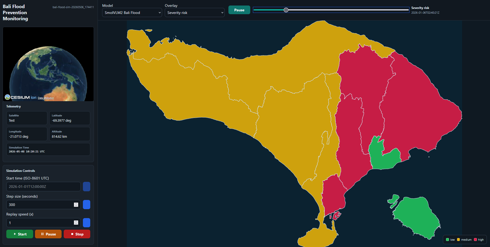
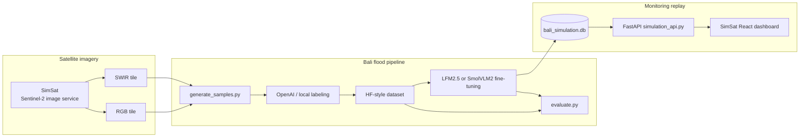

# Bali Flood Prevention Monitoring

An end-to-end flood-risk monitoring project for Bali, Indonesia, built with
Sentinel-2 satellite imagery, compact vision-language models, local simulation,
fine-tuning workflows, and a replayable monitoring dashboard.



The dashboard combines SimSat telemetry, replay controls, model selection, Bali
administrative boundaries, and color-coded flood severity overlays. The goal is
to turn satellite image pairs into structured flood-risk signals that can be
stored, evaluated, replayed, and inspected by local analysts.

## Contents

- [Project Goal](#project-goal)
- [Problem Framing](#problem-framing)
- [System Design](#system-design)
- [Flood-Risk Schema](#flood-risk-schema)
- [Monitoring Area](#monitoring-area)
- [Dataset Pipeline](#dataset-pipeline)
- [Model Evaluation](#model-evaluation)
- [Fine-Tuning](#fine-tuning)
- [Simulation Dashboard](#simulation-dashboard)
- [Quickstart](#quickstart)
- [Repository Structure](#repository-structure)
- [Before Pushing to Git](#before-pushing-to-git)

## Project Goal

Bali has dense urban corridors, coastal tourism infrastructure, river valleys,
paddy fields, upland runoff zones, and low-lying drainage areas. During heavy
rainfall, flooding can affect roads, settlements, cropland, tourism access, and
emergency response routes.

This project asks a compact VLM to read paired Sentinel-2 RGB and SWIR images
for Bali tiles and return a structured flood-risk assessment. The system is
designed to support:

- Bali-wide flood-risk monitoring across administrative areas.
- Dataset creation from real Sentinel-2 image pairs served through SimSat.
- OpenAI-assisted or local skill-assisted labeling with strict JSON validation.
- Fine-tuning of compact VLMs for flood-risk interpretation.
- Evaluation against held-out Bali flood labels.
- Replayable area-level dashboard overlays for analyst review.

## Problem Framing

### Decision Question

For each Bali tile and timestamp:

> What is the flood-prevention risk level, and which visible land, water,
> drainage, exposure, and image-quality signals support that risk level?

The model is not predicting rainfall directly. It is interpreting remote-sensing
evidence that can indicate flood risk or flood exposure, including standing
water, likely temporary inundation, road or infrastructure exposure, coastal or
river overflow context, low-lying terrain, saturated vegetation or soil, and
cloud or shadow limitations.

### Why This Is Useful

Raw satellite imagery is too large and too visual for a response dashboard to
consume directly. The project converts image pairs into a compact JSON payload:

- Easy to downlink or send across services.
- Easy to store in SQLite.
- Easy to aggregate by Bali area and timestep.
- Easy to compare across models.
- Easy to render as `low`, `medium`, and `high` overlays.

### Core Inputs

Each sample contains two images for the same tile:

- **RGB composite (B4-B3-B2):** natural color view for settlements, roads,
  rivers, coastlines, cropland, cloud, terrain texture, and visible water.
- **SWIR composite (B12-B8-B4):** water-sensitive view for separating open
  water, saturated soil, wet vegetation, and dry land.

Metadata is also stored beside each sample:

- Bali region id.
- Timestamp.
- Tile center longitude and latitude.
- Point id and spatial tile id.
- Tile size in kilometers.
- Sentinel metadata from SimSat when available.

## System Design

The project follows a compact edge-inference pattern: image data is fetched and
interpreted near the simulation/inference loop, while only structured results
are saved and displayed.



### Main Components

| Component | Purpose |
|---|---|
| `src/bali_flood_prevention/schema.py` | Canonical JSON schema, prompt text, and label validation. |
| `src/bali_flood_prevention/locations.py` | The 9 Bali administrative monitoring areas. |
| `scripts/generate_samples.py` | Fetches RGB/SWIR samples from SimSat. |
| `scripts/repair_blank_samples.py` | Detects and repairs mostly no-data image pairs. |
| `scripts/label_with_openai.py` | Synchronous OpenAI label generation. |
| `scripts/label_with_openai_batch.py` | Batch API label generation for larger runs. |
| `scripts/build_hf_dataset.py` | Packages labeled samples into Hugging Face dataset format. |
| `scripts/evaluate.py` | Evaluates OpenAI or local GGUF models on the held-out test split. |
| `scripts/train_smolvlm_transformers_modal.py` | SmolVLM2 fine-tuning on Modal H100 using Transformers Trainer. |
| `scripts/finalize_finetune.py` | LFM checkpoint download, quantization, and evaluation finalizer. |
| `scripts/finalize_smolvlm.py` | SmolVLM2 checkpoint download, quantization, and evaluation finalizer. |
| `scripts/build_simulation_db.py` | Builds replayable monitoring DB from January 2026 Sentinel observations. |
| `app/simulation_api.py` | FastAPI service for dashboard state, GeoJSON, images, and SimSat proxy commands. |

## Flood-Risk Schema

Every label and prediction must validate against the same strict schema. Extra
fields are rejected, and fields are serialized in canonical order.

```json
{
  "flood_risk_level": "low | medium | high",
  "water_extent_level": "small | moderate | large",
  "standing_water_present": true,
  "temporary_inundation_likely": false,
  "urban_or_infrastructure_exposure": true,
  "road_or_transport_disruption_likely": false,
  "cropland_or_settlement_exposure": true,
  "river_or_coastal_overflow_context": true,
  "low_lying_or_poor_drainage_area": true,
  "vegetation_or_soil_saturation": false,
  "permanent_water_body_present": true,
  "cloud_shadow_or_image_quality_limited": false,
  "confidence": "low | medium | high"
}
```

### Risk-Level Interpretation

| Level | Meaning |
|---|---|
| `low` | No active flood evidence. The tile may still contain rivers, ocean, cropland, or urban exposure. |
| `medium` | Possible localized standing water, saturated land, flood-prone exposure, or ambiguous water expansion. |
| `high` | Visible abnormal inundation or large water extent affecting or directly threatening settlement, roads, infrastructure, or cropland. |

### Important Labeling Rules

- Do not mark all exposure fields false just because active floodwater is absent.
- Coastal/ocean tiles can have permanent water and overflow context without
  temporary inundation.
- Dense urban tiles should usually mark urban or infrastructure exposure true.
- Cloud-heavy tiles should not receive high confidence.
- If the evidence is unclear, choose the lower risk level and lower confidence.

## Monitoring Area

The project monitors 9 Bali administrative areas:

| Region id | Area |
|---|---|
| `denpasar_bali` | Denpasar |
| `badung_bali` | Badung |
| `bangli_bali` | Bangli |
| `buleleng_bali` | Buleleng |
| `gianyar_bali` | Gianyar |
| `jembrana_bali` | Jembrana |
| `karangasem_bali` | Karangasem |
| `klungkung_bali` | Klungkung |
| `tabanan_bali` | Tabanan |

Each region has fallback coordinates and a bounding box. The dashboard uses the
bundled Bali-only boundary file at `assets/bali_adm2.geojson`, while the point
generator can cache the full geoBoundaries source under `data/boundaries/` when
it needs to sample new monitoring points.

## Dataset Pipeline

### 1. Fetch Unlabeled Samples

Start SimSat first. Then run the full planned sample fetch:

```powershell
uv run scripts/generate_samples.py `
  --start-date 2024-01-01 --end-date 2025-12-31 `
  --points-per-location 10 `
  --n-temporal-tiles 48 `
  --n-spatial-tiles 4 `
  --test-ratio 0.2 `
  --concurrency 3
```

Planned task count:

```text
9 Bali regions x 10 points x 48 timestamps x 4 spatial tiles = 17,280
```

Smoke test:

```powershell
uv run scripts/generate_samples.py `
  --start-date 2024-01-01 --end-date 2025-12-31 `
  --location denpasar_bali `
  --limit 4
```

### 2. Repair Blank or No-Data Samples

```powershell
uv run scripts/repair_blank_samples.py --run-dir data/{run_id} --scan-only
uv run scripts/repair_blank_samples.py --run-dir data/{run_id} --dry-run
uv run scripts/repair_blank_samples.py --run-dir data/{run_id}
```

The repair workflow backs up replaced image pairs under `_repair_backup/`,
updates metadata, and removes any old annotation that belonged to the old image
pair.

### 3. Label Samples

The local Codex labeling skill lives at:

```text
skills/bali-flood-labeler/SKILL.md
```

The manifest for unlabeled samples is:

```text
data/{run_id}/manifests/unlabeled.jsonl
```

For OpenAI API labeling, create a local `.env` file. Do not commit it.

```text
OPENAI_API_KEY=your_key_here
OPENAI_MODEL=gpt-5.5
```

Synchronous small batch:

```powershell
uv run scripts/label_with_openai.py `
  --run-dir data/{run_id} `
  --region denpasar_bali `
  --limit 20
```

OpenAI Batch API dry run:

```powershell
uv run scripts/label_with_openai_batch.py create `
  --run-dir data/{run_id} `
  --region denpasar_bali `
  --limit 5 `
  --reasoning-effort xhigh `
  --dry-run
```

Submit real batch:

```powershell
uv run scripts/label_with_openai_batch.py create `
  --run-dir data/{run_id} `
  --reasoning-effort xhigh `
  --max-requests-per-batch 50 `
  --max-batch-file-mb 180
```

Check and collect:

```powershell
uv run scripts/label_with_openai_batch.py status `
  --batch-manifest data/{run_id}/manifests/openai_batches/{batch_group}/group_manifest.json

uv run scripts/label_with_openai_batch.py collect `
  --batch-manifest data/{run_id}/manifests/openai_batches/{batch_group}/group_manifest.json
```

Validate labels:

```powershell
uv run scripts/check_samples.py {run_id}
uv run scripts/check_samples.py {run_id} --require-labels
```

### 4. Package the Dataset

```powershell
uv run scripts/build_hf_dataset.py --run-dir data/{run_id}

uv run scripts/push_dataset_to_hf.py `
  --run-dir data/{run_id} `
  --hf-dataset YOUR_HF_USER/bali-flood-prevention

uv run scripts/prepare_bali_flood.py `
  --dataset YOUR_HF_USER/bali-flood-prevention
```

Local preparation is also supported:

```powershell
uv run scripts/prepare_bali_flood.py `
  --source-dir data/{run_id}/hf_dataset
```

## Model Evaluation

The evaluator uses the held-out `test` split and never overwrites dataset
annotations. Results are written to:

```text
evals/{timestamp}/report.md
evals/{timestamp}/results.json
evals/{timestamp}/meta.json
```

Dry run:

```powershell
uv run scripts/evaluate.py `
  --dataset data/20260504_150038 `
  --split test `
  --backend openai `
  --limit 3 `
  --dry-run
```

OpenAI sanity-check baseline:

```powershell
uv run scripts/evaluate.py `
  --dataset data/20260504_150038 `
  --split test `
  --backend openai `
  --model gpt-5.4-mini `
  --reasoning-effort low `
  --max-output-tokens 8192 `
  --image-detail low `
  --concurrency 5 `
  --max-errors 10 `
  --retries 0
```

Base LFM2.5-VL-450M:

```powershell
uv run scripts/evaluate.py `
  --dataset data/20260504_150038 `
  --split test `
  --backend local `
  --model LiquidAI/LFM2.5-VL-450M-GGUF `
  --quant Q8_0 `
  --port 8080 `
  --concurrency 1
```

Base SmolVLM2:

```powershell
uv run scripts/evaluate.py `
  --dataset data/20260504_150038 `
  --split test `
  --backend local `
  --model ggml-org/SmolVLM2-500M-Video-Instruct-GGUF `
  --quant Q8_0 `
  --port 8081 `
  --concurrency 1
```

Fine-tuned local GGUF:

```powershell
uv run scripts/evaluate.py `
  --dataset data/20260504_150038 `
  --split test `
  --backend local `
  --model ./outputs/lfm2.5-vl-bali-flood-Q8_0.gguf `
  --mmproj ./outputs/mmproj-lfm2.5-vl-bali-flood-Q8_0.gguf `
  --port 8082 `
  --concurrency 1
```

Open the comparison app:

```powershell
uv run streamlit run app/eval_compare.py
```

### Pre-Fine-Tuning Evaluation Snapshot

Before fine-tuning, the local reports compare the two base compact VLMs against
a GPT sanity-check run on the same `data/20260504_150038` test split:

| Model | n | valid JSON | fields present | flood risk accuracy | overall field accuracy | avg latency |
|---|---:|---:|---:|---:|---:|---:|
| GPT sanity check (`gpt-5.4-mini`) | 450 | 98.4% | 98.4% | 94.9% | 93.3% | 3.18 s |
| LFM2.5-VL-450M base GGUF | 450 | 100.0% | 100.0% | 47.6% | 39.2% | 17.66 s |
| SmolVLM2-500M base GGUF | 450 | 100.0% | 100.0% | 2.9% | 36.9% | 4.90 s |

Important caveat: the current held-out set is skewed toward `low` risk, so
macro flood-risk metrics should be read alongside the confusion matrix. The
overall field score is useful for schema and context-field quality, but more
high-risk Bali flood cases are needed before claiming robust alert performance.

## Fine-Tuning

This project supports two fine-tuning lanes:

- `LiquidAI/LFM2.5-VL-450M` through the Liquid `leap-finetune` path.
- `HuggingFaceTB/SmolVLM2-500M-Video-Instruct` through native Hugging Face
  `transformers.Trainer` on Modal H100.

### Before and After Fine-Tuning

The table below compares the GPT sanity check, base compact models, and
fine-tuned GGUF artifacts on the same 450 held-out test samples. Values are
percentages except `n` and `avg_latency_s`.

| Metric | GPT sanity check | LFM2.5 base | LFM2.5 fine-tuned | SmolVLM2 base | SmolVLM2 fine-tuned |
|---|---:|---:|---:|---:|---:|
| n | 450 | 450 | 450 | 450 | 450 |
| valid_json | 98.4 | 100.0 | 100.0 | 100.0 | 100.0 |
| fields_present | 98.4 | 100.0 | 100.0 | 100.0 | 100.0 |
| flood_risk_level | 94.9 | 47.6 | 97.1 | 2.9 | 26.0 |
| water_extent_level | 92.7 | 11.1 | 90.0 | 68.7 | 52.7 |
| standing_water_present | 90.9 | 36.0 | 74.2 | 36.0 | 60.9 |
| temporary_inundation_likely | 98.4 | 62.0 | 100.0 | 0.0 | 56.7 |
| urban_or_infrastructure_exposure | 94.2 | 58.4 | 70.0 | 58.4 | 63.6 |
| road_or_transport_disruption_likely | 98.4 | 48.2 | 100.0 | 0.0 | 73.8 |
| cropland_or_settlement_exposure | 91.3 | 65.8 | 63.1 | 65.8 | 66.9 |
| river_or_coastal_overflow_context | 90.2 | 36.4 | 72.7 | 36.4 | 54.4 |
| low_lying_or_poor_drainage_area | 89.3 | 45.8 | 62.7 | 45.8 | 61.6 |
| vegetation_or_soil_saturation | 96.0 | 1.3 | 97.6 | 1.3 | 71.8 |
| permanent_water_body_present | 91.3 | 36.0 | 74.2 | 36.0 | 61.3 |
| cloud_shadow_or_image_quality_limited | 96.4 | 51.3 | 95.3 | 89.3 | 89.3 |
| confidence | 88.7 | 9.6 | 88.0 | 38.4 | 57.1 |
| overall | 93.3 | 39.2 | 83.5 | 36.9 | 61.2 |
| avg_latency_s | 3.18 | 17.66 | 4.64 | 4.90 | 20.59 |

Fine-tuning substantially improves both compact models, with the strongest
headline gain coming from LFM2.5-VL-450M: flood-risk accuracy improves from
47.6% to 97.1%, and overall field accuracy improves from 39.2% to 83.5%.
SmolVLM2 also improves overall from 36.9% to 61.2%, although the fine-tuned
artifact is slower in this local GGUF evaluation.

Prepare the dataset in Modal:

```powershell
uv run scripts/prepare_bali_flood.py `
  --dataset YOUR_HF_USER/bali-flood-prevention `
  --modal
```

Launch LFM2.5 fine-tuning from Windows:

```powershell
uv run scripts/launch_leap_modal.py configs/bali_flood_finetune_modal.yaml
```

Launch SmolVLM2 fine-tuning:

```powershell
uv run scripts/train_smolvlm_transformers_modal.py
```

SmolVLM2 smoke training:

```powershell
uv run scripts/train_smolvlm_transformers_modal.py `
  --limit 16 `
  --epochs 0.05 `
  --output-dir /outputs/SmolVLM2-500M-Video-Instruct-transformers-bali_flood-smoke
```

Finalize LFM2.5:

```powershell
uv run scripts/finalize_finetune.py
```

Finalize SmolVLM2:

```powershell
uv run scripts/finalize_smolvlm.py
```

Push a GGUF pair to Hugging Face:

```powershell
uv run scripts/push_gguf_to_hf.py `
  --backbone ./outputs/lfm2.5-vl-bali-flood-Q8_0.gguf `
  --mmproj ./outputs/mmproj-lfm2.5-vl-bali-flood-Q8_0.gguf `
  --repo YOUR_HF_USER/lfm2.5-vl-bali-flood-GGUF
```

## Simulation Dashboard

The dashboard uses precomputed predictions from `bali_simulation.db`. During
playback, the UI reads database aggregates rather than running inference live.

### Build Replay DB

Start SimSat first, then run:

```powershell
uv run scripts/build_simulation_db.py `
  --start-date 2026-01-01 `
  --end-date 2026-01-31 `
  --max-timesteps 6 `
  --points-per-location 10 `
  --seed 42 `
  --models lfm2,smolvlm2
```

The script creates:

- `bali_simulation.db`
- image evidence under `simulation_images/`
- area/timestep aggregates for dashboard playback

Available model ids are defined in `src/bali_flood_prevention/simulation.py`:

- `lfm2`: `LFM2.5-VL Bali Flood`
- `smolvlm2`: `SmolVLM2 Bali Flood`

### Start API

```powershell
uv run uvicorn app.simulation_api:app --reload --port 8010
```

Useful endpoints:

| Endpoint | Purpose |
|---|---|
| `/api/runs` | List simulation runs. |
| `/api/state` | Dashboard state, passes, models, areas, overlays, and aggregates. |
| `/api/geojson` | Bali area boundary features. |
| `/api/areas/{area_id}/observations` | Evidence image rows for one area and pass. |
| `/api/observations/{id}/image/rgb` | RGB evidence image. |
| `/api/observations/{id}/image/swir` | SWIR evidence image. |
| `/api/simsat/telemetry` | SimSat telemetry proxy. |
| `/api/simsat/commands` | SimSat start, pause, stop, and replay commands. |

### Start Frontend

The Bali React dashboard is tracked in this repository under `frontend/`:

```powershell
cd frontend
npm install
npm run dev -- --host 127.0.0.1
```

The dashboard expects:

```text
VITE_SIMSAT_DASHBOARD_URL=http://localhost:8000/api
VITE_BALI_SIM_API_URL=http://localhost:8010/api
```

Open the printed Vite URL.

## Quickstart

### Prerequisites

- Python 3.11 or newer.
- `uv`.
- Docker for SimSat.
- Node.js and npm for the React dashboard.
- `llama-server` on `PATH` for local GGUF inference.
- OpenAI API key for OpenAI-based labeling or evaluation.
- Hugging Face and Modal authentication for dataset/model publishing and
  fine-tuning.

### Fresh Setup

```powershell
uv sync
```

Clone and start SimSat:

```powershell
git clone https://github.com/DPhi-Space/SimSat.git SimSat
cd SimSat
docker compose up
```

In a new terminal from the project root:

```powershell
uv run uvicorn app.simulation_api:app --reload --port 8010
```

In another terminal:

```powershell
cd frontend
npm install
npm run dev -- --host 127.0.0.1
```

If `bali_simulation.db` already exists, the dashboard can load it immediately.
If not, build it with `scripts/build_simulation_db.py` after the local GGUF
artifacts are available.

## Repository Structure

```text
.
  app/
    eval_compare.py
    simulation_api.py
    train_dashboard.py
  assets/
    bali_adm2.geojson
    bali_flood_monitoring.png
  configs/
    bali_flood_finetune_modal.yaml
  frontend/
    package.json
    src/
  scripts/
    build_simulation_db.py
    generate_samples.py
    label_with_openai.py
    label_with_openai_batch.py
    evaluate.py
    finalize_finetune.py
    finalize_smolvlm.py
    train_smolvlm_transformers_modal.py
  src/
    bali_flood_prevention/
      schema.py
      locations.py
      simulation.py
      evaluator.py
  templates/
    smolvlm-image-url.jinja
  tests/
  pyproject.toml
  uv.lock
  README.md
```

Generated or local-only folders are intentionally ignored by Git:

- `.venv/`
- `.env`
- `data/`
- `evals/`
- `outputs/`
- `simulation_images/`
- `bali_simulation.db`
- Python caches and pytest caches
- Local dependency clones: `SimSat/`, `leap-finetune/`, and `llama.cpp/`
- Frontend generated folders: `frontend/node_modules/` and `frontend/dist/`

## Before Pushing to Git

Use this checklist before publishing the project:

- README screenshot exists at `assets/bali_flood_monitoring.png`.
- `.env` is not committed.
- Large generated artifacts are not committed unless intentionally released
  elsewhere.
- `uv.lock` and `pyproject.toml` are committed for reproducible setup.
- Tests pass with `uv run python -m unittest discover -s tests`.
- Dashboard API starts with `uv run uvicorn app.simulation_api:app --reload --port 8010`.
- The frontend starts from `frontend/`.
- Any Hugging Face repo names are changed from placeholders to your account.

Recommended repository description:

```text
Compact VLM satellite monitoring system for Bali flood-risk prevention.
```
